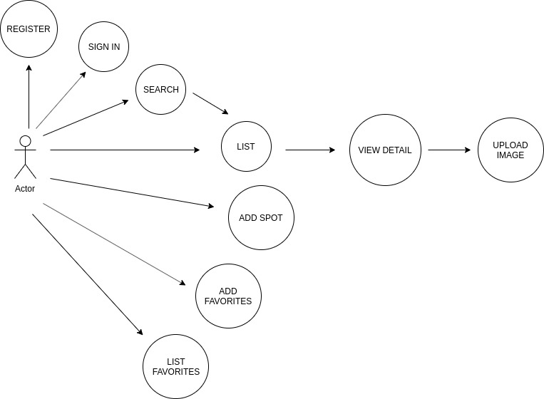
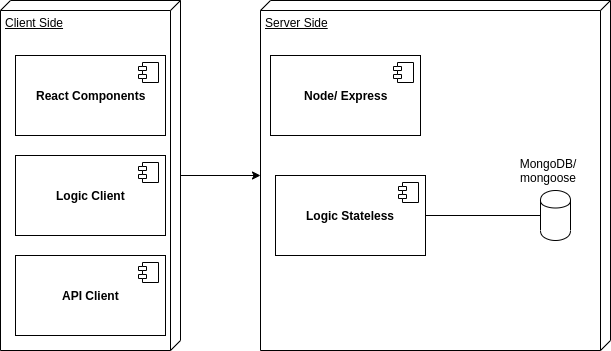
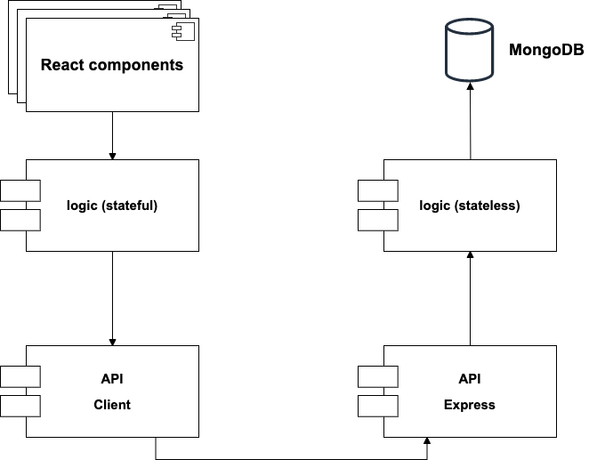
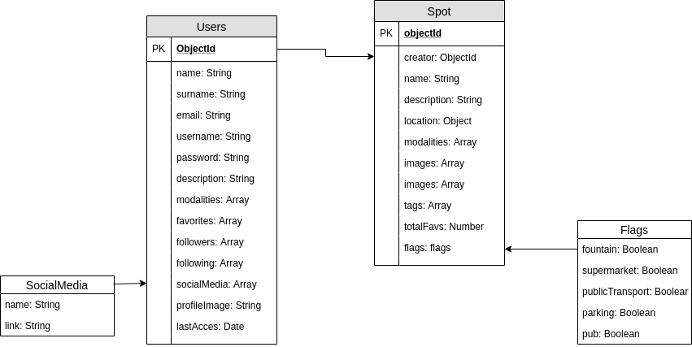
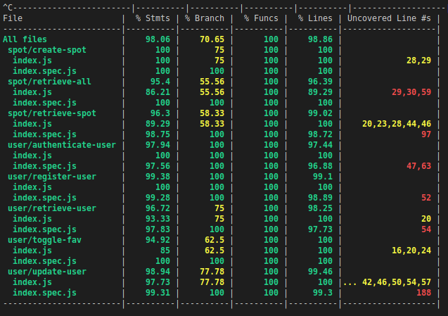

# Flott

## Introduction:

**Flott** is an app designed for people who practice action sports and want to find new places where they can practice it and meet new people.

The application is developed:
- Front-end:
    - [React](https://reactjs.org)
    - [SASS](https://sass-lang.com/)
- Back-end:
    - [node.js](https://nodejs.org/es/) (using [express.js](http://expressjs.com/) and [mongoose.js](https://mongoosejs.com/))
    - [MongoDB](https://www.mongodb.com/)

## Functional Description

### Use Cases

## Technical Description:

### Blocks

### Components

### Data Model

## Code Coverage

## Future updates
- Finish test app logic
- Modify User
- Modify Spot
- Implent geolocation
- Maps
- Add posts
- Followers
- Filters in search
